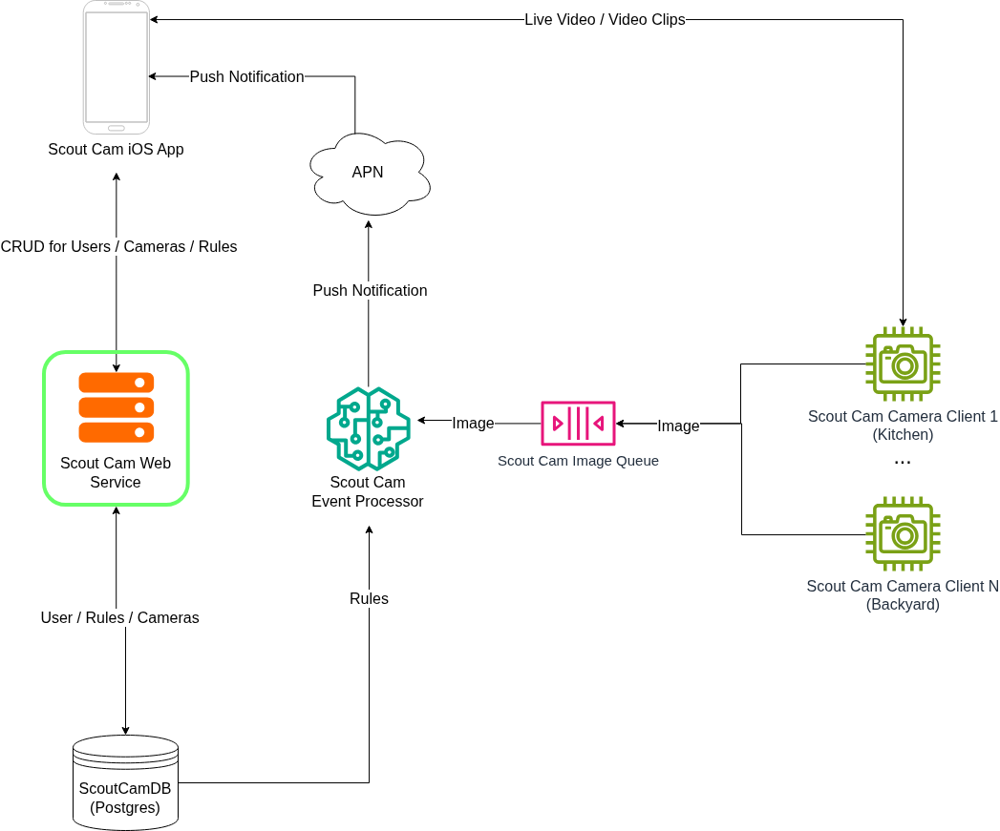

# ScoutCamService

A web service built using Django for managing users, cameras, and rules for the scout notification camera system.
This web service handles registering / logging in users, and CRUD operations for users, cameras and rules for cameras.
All endpoints are secured using JWTs and the service is currently designed to be used with postgres version 18+ because it uses the
UUIDv7 function.

# System Diagram


### Brief Overview
[Scout Cam Web Service](https://github.com/ataffe/ScoutCamEventProcessor) - Handles CRUD operations for Users, Cameras, and Rules.

[Scout Cam Event Processor](https://github.com/ataffe/GuardianCamCameraClient) - Processes images received from cameras and send users a push notification if the 
image matches one or more of the users rules.

[Scout Cam Camera Client](https://github.com/ataffe/GuardianCamCameraClient) - Detects Motion and filters images using object detection and then sends the image to the 
event processor if an object is detected.

Scout Cam iOS App - User app for managing cameras and notifing the user of events.

---


# Database Tables

## `users`

| Column | Type | Notes |
|--------|------|-------|
| `id` | `bigint` | Primary key, auto-increment |
| `public_user_id` | `uuid` | UUIDv7, unique, non-editable |
| `email` | `varchar(255)` | Unique |
| `first_name` | `varchar(150)` | |
| `last_name` | `varchar(150)` | |
| `username` | `varchar(150)` | Unique |
| `password` | `varchar(128)` | Hashed |
| `is_active` | `boolean` | |
| `is_staff` | `boolean` | |
| `is_superuser` | `boolean` | |
| `date_joined` | `timestamptz` | |
| `last_login` | `timestamptz` | Nullable |

## `camera_camera`

| Column | Type | Notes |
|--------|------|-------|
| `id` | `bigint` | Primary key, auto-increment |
| `public_camera_id` | `uuid` | UUIDv7, unique, non-editable |
| `owner_id` | `bigint` | Foreign key → `users.id` |
| `location` | `varchar(100)` | |
| `created_at` | `timestamptz` | Auto-set on create |

## `rules_rule`

| Column | Type | Notes |
|--------|------|-------|
| `id` | `bigint` | Primary key, auto-increment |
| `public_rule_id` | `uuid` | UUIDv7, unique, non-editable |
| `owner_id` | `bigint` | Foreign key → `users.id` |
| `camera_id` | `bigint` | Foreign key → `camera_camera.id` |
| `rule` | `varchar(240)` | |
| `rule_nickname` | `varchar(240)` | |
| `is_enabled` | `boolean` | Default: `true` |
| `created_at` | `timestamptz` | Auto-set on create |

---


# API URL Reference

## Authentication

| Method | URL | Name |
|--------|-----|------|
| POST | `/v1/auth/register/` | `users:register` |
| POST | `/v1/auth/token/` | `users:token_obtain_pair` |
| POST | `/v1/auth/token/refresh/` | `users:token_refresh` |

### `POST /v1/auth/register/`

Request:
```json
{
  "first_name": "Jane",
  "last_name": "Doe",
  "email": "jane.doe@example.com",
  "password": "securepassword123"
}
```

Response `201 Created`:
```json
{
  "first_name": "Jane",
  "last_name": "Doe",
  "email": "jane.doe@example.com",
  "public_user_id": "019731a2-1234-7abc-8def-000000000001"
}
```

### `POST /v1/auth/token/`

Request:
```json
{
  "email": "jane.doe@example.com",
  "password": "securepassword123"
}
```

Response `200 OK`:
```json
{
  "access": "<jwt-access-token>",
  "refresh": "<jwt-refresh-token>"
}
```

### `POST /v1/auth/token/refresh/`

Request:
```json
{
  "refresh": "<jwt-refresh-token>"
}
```

Response `200 OK`:
```json
{
  "access": "<jwt-access-token>"
}
```

---

## Users

| Method | URL | Name |
|--------|-----|------|
| GET | `/v1/users/` | `users:user_list` |
| GET | `/v1/user/<uuid:public_user_id>/` | `users:user_detail` |

### `GET /v1/users/`

Response `200 OK`:
```json
[
  {
    "first_name": "Jane",
    "last_name": "Doe",
    "email": "jane.doe@example.com",
    "public_user_id": "019731a2-1234-7abc-8def-000000000001"
  }
]
```

### `GET /v1/user/<public_user_id>/`

Response `200 OK`:
```json
{
  "first_name": "Jane",
  "last_name": "Doe",
  "email": "jane.doe@example.com",
  "public_user_id": "019731a2-1234-7abc-8def-000000000001"
}
```

---

## Cameras

| Method | URL | Name |
|--------|-----|------|
| GET, POST | `/v1/cameras/` | `camera:camera-list` |
| GET, PUT, PATCH, DELETE | `/v1/cameras/<public_camera_id>/` | `camera:camera-detail` |

### `GET /v1/cameras/`

Response `200 OK`:
```json
[
  {
    "id": 1,
    "public_camera_id": "019731a2-1234-7abc-8def-000000000002",
    "owner": "jane.doe@example.com",
    "location": "Front Door",
    "created_at": "2026-04-28T12:00:00Z"
  }
]
```

### `POST /v1/cameras/`

Request:
```json
{
  "location": "Front Door"
}
```

Response `201 Created`:
```json
{
  "id": 1,
  "public_camera_id": "019731a2-1234-7abc-8def-000000000002",
  "owner": "jane.doe@example.com",
  "location": "Front Door",
  "created_at": "2026-04-28T12:00:00Z"
}
```

### `GET /v1/cameras/<public_camera_id>/`

Response `200 OK`:
```json
{
  "id": 1,
  "public_camera_id": "019731a2-1234-7abc-8def-000000000002",
  "owner": "jane.doe@example.com",
  "location": "Front Door",
  "created_at": "2026-04-28T12:00:00Z"
}
```

### `PUT /v1/cameras/<public_camera_id>/`

Request:
```json
{
  "location": "Back Door"
}
```

Response `200 OK`:
```json
{
  "id": 1,
  "public_camera_id": "019731a2-1234-7abc-8def-000000000002",
  "owner": "jane.doe@example.com",
  "location": "Back Door",
  "created_at": "2026-04-28T12:00:00Z"
}
```

### `DELETE /v1/cameras/<public_camera_id>/`

Response `204 No Content`

---

## Rules

| Method | URL | Name |
|--------|-----|------|
| GET, POST | `/v1/cameras/<public_camera_id>/rules/` | `rules:camera-rules-list` |
| GET, PUT, PATCH, DELETE | `/v1/cameras/<public_camera_id>/rules/<public_rule_id>/` | `rules:camera-rules-detail` |

### `GET /v1/cameras/<public_camera_id>/rules/`

Response `200 OK`:
```json
[
  {
    "id": 1,
    "public_rule_id": "019731a2-1234-7abc-8def-000000000003",
    "owner": 1,
    "camera": 1,
    "rule": "Alert when motion detected after 10pm",
    "rule_nickname": "Night Motion Alert",
    "is_enabled": true,
    "created_at": "2026-04-28T12:00:00Z"
  }
]
```

### `POST /v1/cameras/<public_camera_id>/rules/`

Request:
```json
{
  "rule": "Alert when motion detected after 10pm",
  "rule_nickname": "Night Motion Alert",
  "is_enabled": true
}
```

Response `201 Created`:
```json
{
  "id": 1,
  "public_rule_id": "019731a2-1234-7abc-8def-000000000003",
  "owner": 1,
  "camera": 1,
  "rule": "Alert when motion detected after 10pm",
  "rule_nickname": "Night Motion Alert",
  "is_enabled": true,
  "created_at": "2026-04-28T12:00:00Z"
}
```

### `GET /v1/cameras/<public_camera_id>/rules/<public_rule_id>/`

Response `200 OK`:
```json
{
  "id": 1,
  "public_rule_id": "019731a2-1234-7abc-8def-000000000003",
  "owner": 1,
  "camera": 1,
  "rule": "Alert when motion detected after 10pm",
  "rule_nickname": "Night Motion Alert",
  "is_enabled": true,
  "created_at": "2026-04-28T12:00:00Z"
}
```

### `PUT /v1/cameras/<public_camera_id>/rules/<public_rule_id>/`

Request:
```json
{
  "rule": "Alert when motion detected after 11pm",
  "rule_nickname": "Late Night Motion Alert",
  "is_enabled": true
}
```

Response `200 OK`:
```json
{
  "id": 1,
  "public_rule_id": "019731a2-1234-7abc-8def-000000000003",
  "owner": 1,
  "camera": 1,
  "rule": "Alert when motion detected after 11pm",
  "rule_nickname": "Late Night Motion Alert",
  "is_enabled": true,
  "created_at": "2026-04-28T12:00:00Z"
}
```

### `PATCH /v1/cameras/<public_camera_id>/rules/<public_rule_id>/`

Request:
```json
{
  "is_enabled": false
}
```

Response `200 OK`:
```json
{
  "id": 1,
  "public_rule_id": "019731a2-1234-7abc-8def-000000000003",
  "owner": 1,
  "camera": 1,
  "rule": "Alert when motion detected after 11pm",
  "rule_nickname": "Late Night Motion Alert",
  "is_enabled": false,
  "created_at": "2026-04-28T12:00:00Z"
}
```

### `DELETE /v1/cameras/<public_camera_id>/rules/<public_rule_id>/`

Response `204 No Content`

## Admin

| URL | Name |
|-----|------|
| `/admin/` | `admin:index` |
| `/admin/auth/group/` | `admin:auth_group_changelist` |
| `/admin/auth/group/add/` | `admin:auth_group_add` |
| `/admin/auth/group/<id>/change/` | `admin:auth_group_change` |
| `/admin/auth/group/<id>/delete/` | `admin:auth_group_delete` |
| `/admin/auth/group/<id>/history/` | `admin:auth_group_history` |
